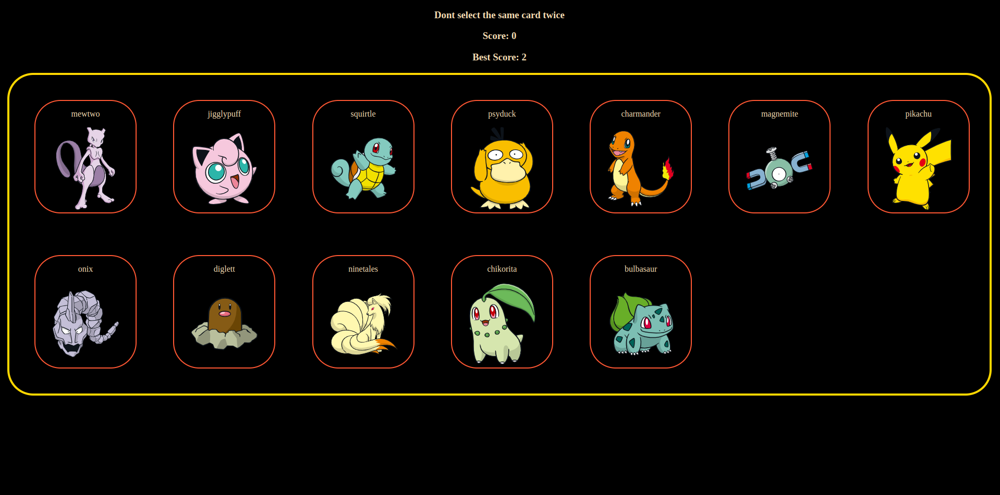

# Memory Card Game

Memory Card Game is a web-based game developed using React, where players aim to select unique cards without picking the same card twice. This project demonstrates proficiency in React, JavaScript, CSS, and data integration through PokeAPI.

## Features

- Responsive memory card game.
- Shuffling of cards for enhanced gameplay.
- Score tracking to challenge players.
- Integration with PokeAPI to display Pokémon cards.

## Technologies Used

- React: A JavaScript library for building user interfaces.
- JavaScript: The primary programming language used for the project.
- CSS: Styling the components and layout.
- [PokeAPI](https://pokeapi.co/): Used to fetch Pokemon data.

## Project Structure

The project adheres to React best practices:

- **src**: Contains the source code.
  - **components**: Houses reusable React components.
  - **App.jsx**: The primary application component.
  - **useGetData.js**: A custom hook for fetching Pokémon data.
  - **index.css**: Global CSS styles.
- **tests**: Includes unit tests for components and hooks.
- **public**: Contains static assets and the HTML entry point.

## Development Highlights

- Utilized React Strict Mode for enhanced code quality.
- Leveraged React hooks for efficient state management.
- Implemented modular component architecture for enhanced maintainability.
- Implemented game logic and user experience enhancements.
- Integrated PokeAPI for data retrieval and dynamic content rendering.

## Deployment

The project is deployed and can be accessed at [Memory-card-game](https://memory-card-game-gray.vercel.app/). Deployment was achieved using.

## Contributing

Contributions to this project are welcome! If you'd like to contribute, please follow these steps:

1. Fork the repository.
2. Create a new branch for your feature or bug fix: `git checkout -b feature/your-feature-name`
3. Make your changes and commit them: `git commit -m 'Add some feature'`
4. Push to the branch: `git push origin feature/your-feature-name`
5. Create a pull request to the main branch of this repository.
